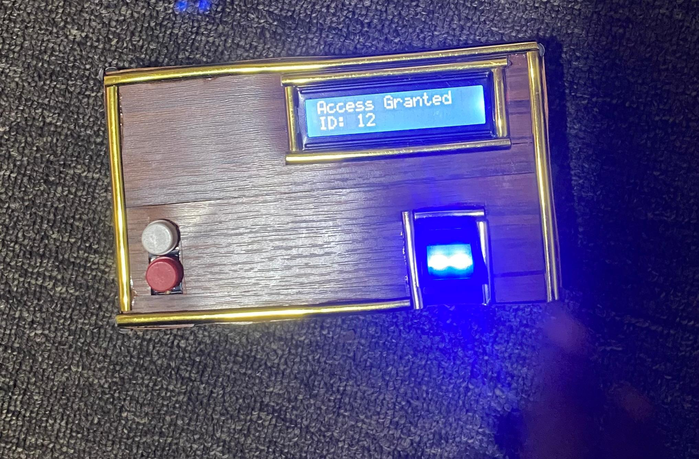
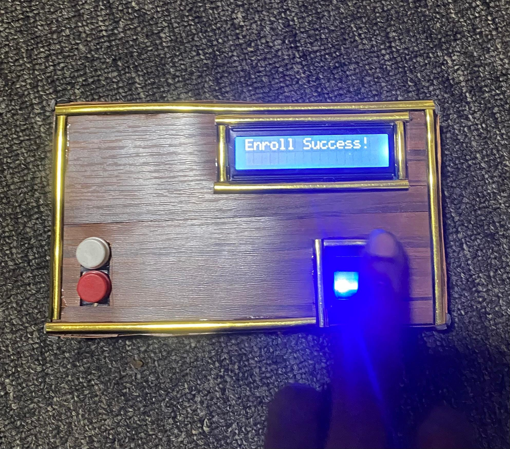
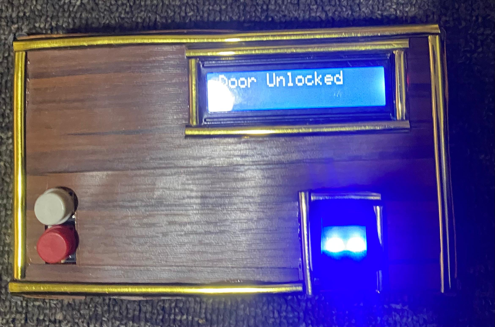
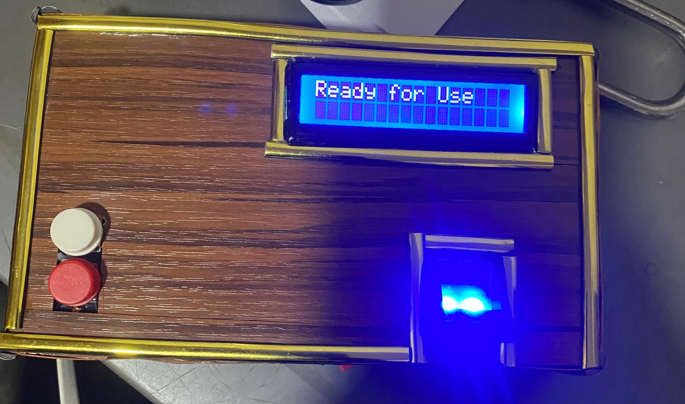
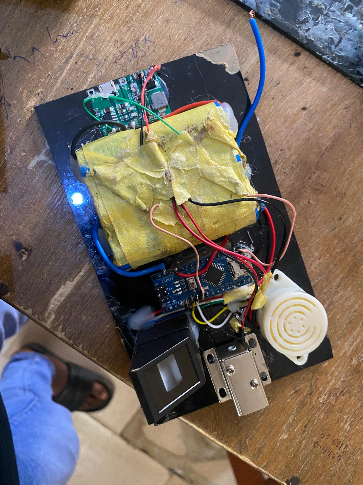
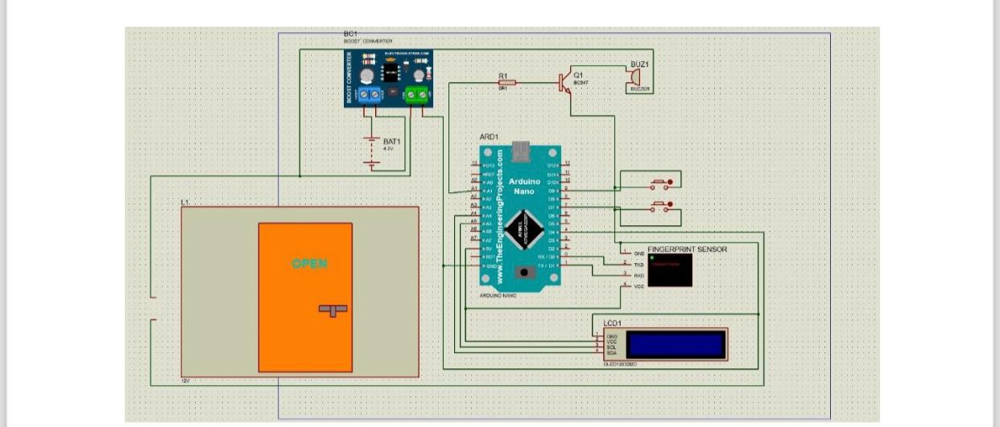

# Biometric-doorlock-system
# Biometric Automatic Door Lock Access Control System

Final-year B.Eng. project
Federal University of Technology Akure (FUTA), Nigeria – 2025  

## Overview
This project implements a fingerprint-based authentication system for secure physical access control.  

The system integrates hardware and embedded software to create a reliable door locking mechanism capable of enrolling users, verifying fingerprints, and controlling access to authorized individuals only.

## Features
- Fingerprint enrollment and verification  
- Secure access control (authorized users only)  
- OLED display feedback ("Ready for Use", "Place Finger", "Enroll Success", "Access Granted", "Access Denied")  
- Buzzer alert for unauthorized attempts  
- Error handling and system reliability  

## Hardware Components
- Microcontroller: Arduino Nano  
- Fingerprint sensor  
- Relay module (controls door lock)  
- OLED display  
- Buzzer  
- Power supply (battery + boost converter)  

## Software
- Language: Arduino C
  
- Libraries: Adafruit Fingerprint Sensor Library
  
- Implemented functions:  
  - Fingerprint enrollment mode  
  - Fingerprint verification mode  
  - Timeout handling  
  - Error detection  

## System Operation
1. User places finger on the fingerprint sensor  
2. System compares fingerprint with stored templates  
3. If match found:  
   - Relay activates → door unlocks  
   - OLED shows "Access Granted"  
4. If no match:  
   - Access denied  
   - Buzzer alert triggered  

## Prototype Photos

  
  
  
  

  

## Documentation & Code
- [Download Full Project Report (PDF)](docs/ABIOLA_undergrad_project_.pdf)
  
- Source code is in the `src` folder  

## Possible Future Improvements

- Remote access monitoring via network connection
- Mobile application interface for system management
- Cloud-based logging of access attempts

---
Developed by  
**Yusuf Abiola Oluwapelumi**  
B.Eng. Computer Engineering  
Federal University of Technology Akure (FUTA)
